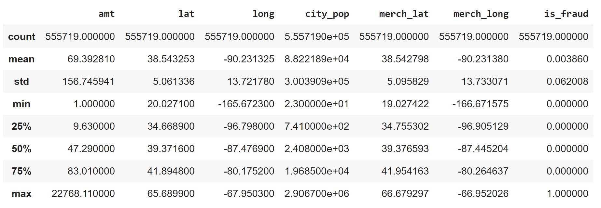
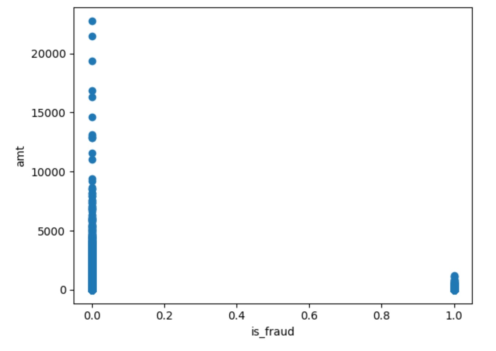
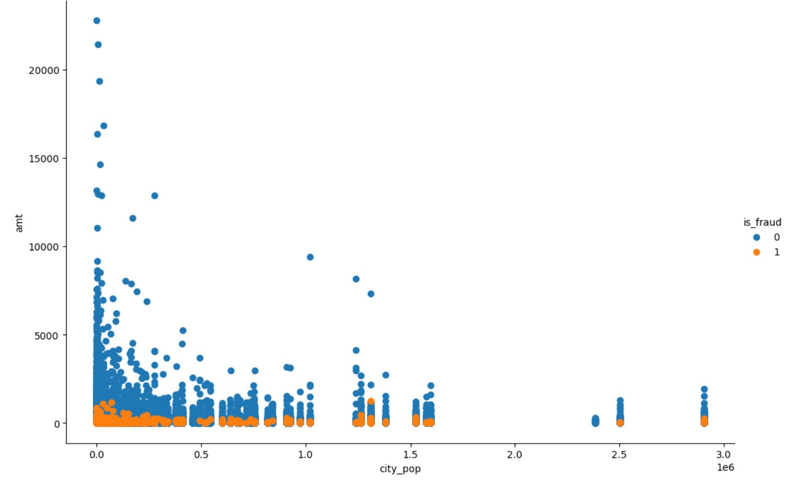
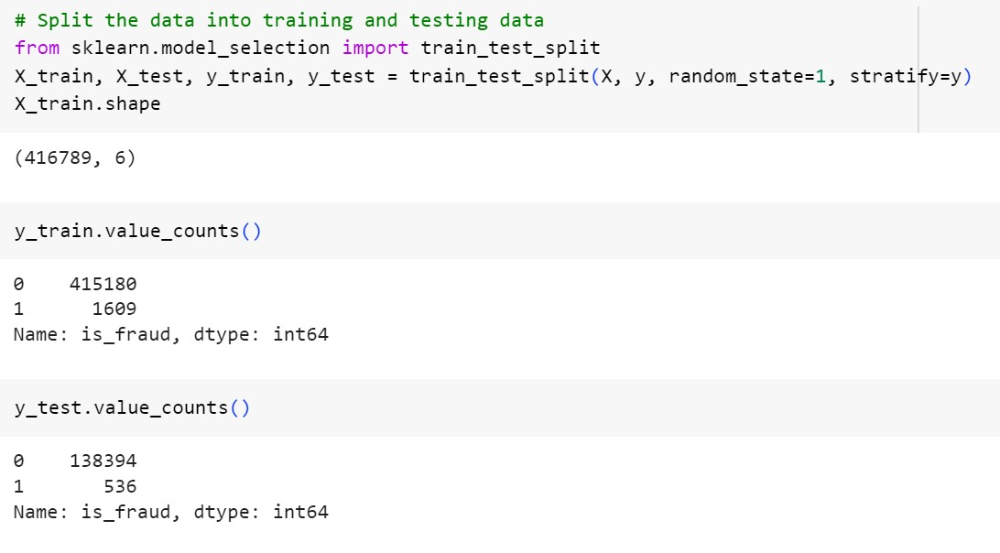
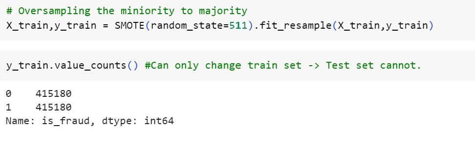
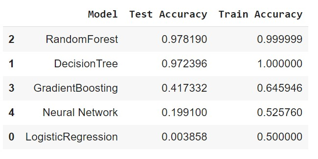

# Credit-Card-Fraud-Analysis-and-Modeling
# Credit Card Fraud Analysis using Tableau and Develop Suitable ML Model

# 1. Introduction:
Credit card fraud is a significant concern for financial institutions and individuals alike. It can result in substantial financial losses and damage to the reputation of both the cardholders and the issuing banks. To address this issue, the application of machine learning techniques has gained significant attention. This project aims to analyze and visualize Credit Card Fraud patterns using Tableau and to develop and compare credit card fraud analysis models using machine learning tools and techniques which can be used to detect and prevent fraudulent transactions effectively.

# 2. Objectives:
The primary objectives of this project are as follows:
1.  To create Tableau dashboards and stories about the patterns of credit card frauds for the given dataset.
2.	To study, compare and develop the most accurate supervised machine learning algorithm/model to detect fraudulent transactions.

# 3. Tools and Techniques used:
 * Languages: Python
 * Libraries: Pandas, Numpy, Matplotlib, Scikit-Learn.
* Tools: Tableau and Google Colab.
 

# 4. Methodology:
1. Data Sourcing from www.keggal.com

2.	Data Visualization using Tableau

3.	Machine Learning Model Development:
* Load the data from the CSV file.
* Clean the data: drop non-numeric columns and prepare the required data frame.
* Describe the data of the data frame:

* Data Visualization
*	a. Relationship between the amount of transaction and fraudulent or non-fraudulent category of transaction.

*	b. Relationship among the amount, fraudulent or non-fraudulent category, and city population of transactions.

*	MACHINE LEARNING
i.	Split the data into X(features) and y(target), and then into testing and training sets.
ii.	‘is_fraud’ column is set as our target and the rest are features.
iii.	Split the data into testing and training sets.

iv. Since y_train value is highly imbalanced and discrete, we used SMOTE(Synthesized Minority Oversampling Technique) for oversampling minority to majority class to balance the dataset. It improves the model performance by balancing the dataset.

v. Normalization of testing and training sets
vi. Run the models:
  * Model 1: Logistic Regression
  * Model 2: Decision Tree
  * Model 3: Random Forest
  * Model 4: Gradient Boosting
  * Model 5: Neural Network
* For each model the datasets (training and testing) were fit, trained into the model, predicted, created confusion matrix, and finally calculated the accuracy score.
vii.	Accuracy comparison of the models
* The test and train accuracy score of each model is compared

# 5. Summary and Conclusion:
Fraud Transactions occur for an amount below 2500. Thus, the bank can infer clearly that the fraud committers try to commit fraud of smaller amounts to avoid suspicion.
*	The fraud transactions are equitably distributed throughout the range of the city population and there is no clear relationship between the city population with committing fraud.
*	The number of fraud transactions is very few compared to legitimate transactions and it has to be balanced in order for a fair comparison to prevent the model from overfitting.
*	SMOTE overcomes overfitting by synthetically oversampling minority class labels.
*	Among 5 different models used, Random Forest Model and Decision Tree model gave the maximum accuracy for the Test set and Train set. Random Forest Algorithm is robust against overfitting, robust to outliers and non-linear data, and runs efficiently on large databases. Hence, we would choose the Random Forest method over the Decision Tree model for our dataset to predict fraudulent transactions.

# 6. Limitations/challenges:
* The limitation of the project is the data source. To detect fraudulent transactions using machine learning requires large amounts of high-quality data to learn and make accurate predictions.
* Another limitation/challenge is the dynamic nature of fraud patterns. Fraudsters are continually evolving their tactics, and new fraud patterns emerge regularly.

# 7. Scope: 
* Continuous monitoring of data and machine learning models, updating the models, and retraining them to detect new patterns.
* Use a combination of supervised and unsupervised learning methods to analyze large amounts of data and detect patterns that are indicative of fraudulent activities. Using unsupervised machine learning algorithms can identify new fraud patterns as they emerge, enabling banks to stay ahead of fraudsters’ tactics.
* Leverage human intelligence to validate suspicious activities, ensuring the accuracy of the fraud detection system. Combining machine learning with human intelligence can reduce the number of false positives, enabling banks to focus their resources on genuine fraud cases. 

